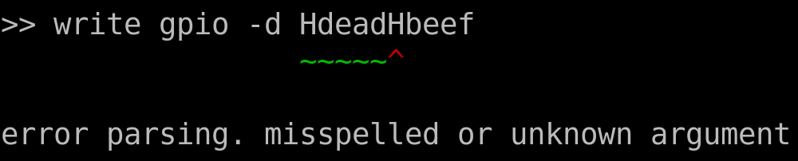

# About
Yet Another Command Line (Program)

This program lets you write simple commands in a VT100 terminal to execute reads and writes to various
external devices over their respective protocols. The program is hosted on the embedded device.

## Requirements 
Built and tested only with STM32F4 on WIN10 & Pop_OS!

* CMake >= 3.16*
* GCC (arm-none-eabi)
* STM32Cube Package as needed
* PuTTY - configuration needed
* [STM32 CMake by ObKo](https://github.com/ObKo/stm32-cmake)
* STM32 MCU

###### \* I used the default value CLion ships with. Minimum requirement comes from ObKo's cmake scripts

## Build System
YACL is its own static library that can be installed or compiled within your project as a CMake subdirectory.

### CMake Environment Variables

* `STM32_CUBE_<FAMILY>_PATH` - path to STM32 files
* `STM32_TOOLCHAIN_PATH` - path to GCC toolchain

### System Environment Variables

* `CMAKE_STM32_SCRIPTS` - path to ObKo's cmake scripts 
* `EMBEDDED_LIBS` - custom install-directory*

I personally use a program, like CLion, to handle CMake for me. I do not use the command line, unless needed.
I have tested the CMake tools in Visual Studio Code before, and it works just fine.

###### \* I do not like the idea of installing in the default path, which requires admin permissions on Windows

## Usage

#### CMake Install
1. Configure compile options to suit your target MCU 
2. Run install target in YACL project
3. In your project `find_package(YACL 1.0 REQUIRED)`
4. In your project `target_link_libraries(<TARGET> <PUBLIC/PRIVATE> YACL::YACL)`

#### CMake Subdirectory
1. Add `yacl/` source folder to your project (maybe as a submodule)
2. `add_subdirectory(yacl)` where `yacl` contains the CMakeLists.txt with the `add_library` command for YACL
3. `target_include_directories(<TARGET> <PUBLIC/PRIVATE> yacl)`
4. `target_link_libraries(<TARGET> <PUBLIC/PRIVATE> YACL)`

#### Code

1. Include the header file `#include "yacl.h"`
2. Provide the corresponding protocol functions
3. Optionally define a `yacl_graph_s` struct to define initial plotting appearance. 

```C
void usr_<protocol>_read(yacl_inout_data_s* inout_data);
void usr_<protocol>_write(yacl_inout_data_s* inout_data);
void usr_<protocol>_plot(yacl_inout_data_s* inout_data);
```
3. Make a callback struct, fill in members and initialize

```C
yacl_usr_callbacks_s callbacks;
yacl_set_cb_null(&callbacks);       // helper function for ensuring callback validity

callbacks.usr_print_funcs.usr_printf = printf;

callbacks.usr_<protocol>_read = usr_<protocol>_read;
callbacks.usr_<protocol>_write = usr_<protocol>_write;
callbacks.usr_<protocol>_plot = usr_<protocol>_plot;

yacl_init(&callbacks, NULL);        // pass reference to locally defined yacl_graph_s instead of NULL
```

5. Write to YACL's input buffer by calling `yacl_wr_buf` inside UART IRQ and passing YACL the received data
6. Simply call `yacl_parse_cmd` periodically to run the terminal to accept commands
7. Plotting can be achieved by calling `yacl_plot` and passing a float value (inside the plot action callback function)

#### Terminal

1. Command Signatures

```
<action>  <protocol>  <options>  <data>
<action>  <protocol>

<action::set>  <options>  <data>

<action::clear>
<action::help>
```

3. Actions

* `write` call write function callback
* `read` call read function callback
* `plote` call plot function callback

3. Streams (protocols)

Source of data, like a stream of data.

* `gpio` 
* `i2c`
* `spi`

4. Options

* `-d` write to a data array. length is 32 uint32_t
* `-r` write to a register (address) array. length is 32 uint32_t
* `-s` stream peripheral address
* `-w` can be used in a switch statement meant to change callback behavior at runtime


* `-u` upper bound on graph
* `-l` lower bound on graph
* `-a` number of samples inside the graph
* `-t` number of steps between the lower and upper bounds
* `-n` the unit description. max length is 8 characters

3. Examples

```
>> write gpio -d 1
>> write gpio -d H0
>> read gpio
>> clear 
```

#### YACL Behavior

1. YACL uses VT220/VT100 escape sequences to control PuTTY over UART
2. YACL pre-proccesses data coming from UART to intercept escape sequences. When `\r` (PuTTY limitation) is received, the written portion is passed to a parser
3. When expecting input to plot, YACL ignores all input except `q` which is used to stop plotting. A clear command will remove the plot from the screen.
4. All the parameters for plotting can be changed at runtime using the `set` action
5. Plotting will start from the left and move towards the right. When the right most edge is met, plotting becomes significantly slower due to lack of advanced VT100 escape sequences that are support by PuTTY
6. All actions can directly change the values within the `yacl_inout_data_s` data type. Except `clear`.
7. YACL preserves the last write to `yacl_inout_data_s` such that the following is intended behavior. The previously written numerical one is passed to the `write gpio` callback function
```
>> set -d 1
>> write gpio
```
7. `yacl_inout_data_s` has an internal second data buffer meant for reading data from peripherals, which can even be shared using this approach
8. YACL does not display the output from calling callback functions. That is up to the user to implement as viewing data will be very different depending on the objectives of the end user.
9. The `-w` option is a dedicated behavior control variable. To change the desired behavior of a callback function without the need to specify specifc entries within the `-d`
or `-r` options. The same idea is used for the `-s` option, which is a dedicated peripheral address options
10. There is a debug tool that I have used. To invoke it, press `backslash` once. I may expand this to inspect `yacl_inout_data_s` and to use a non-printable character
#### YACL Parser

To simplify development and make certain features feasible, I used [Ragel](https://www.colm.net/open-source/ragel/) to generate a state-machine parser that allows me to simply walk the text and pick up tokens with only worrying about the grammar.
Ragel also enabled me to have a very nice visual report of incorrect syntax. (For sake of time and complexity, I have chosen to use a capital H to denoted hexadecimal values.)



If using Ragel on Windows, I would advise using `apt` in `WSL2` instead of trying to install it on Windows

#### Configuring PuTTY

1. Local echo -- off
2. Local line editing -- off
3. Setup serial with the parameters from your UART initialization code

#### YACL Is Not

* A library that provides I2C, SPI or any other protocol support. It merely calls your implementations with associated data (i2c device address, for example)
* A command line interface with full keyboard support. Left/Right arrow keys and backspace are supported. Characters can also be inserted. Limit of 254 characters.
* Properly tested (do not try them, they will not work)

### Future Goals

* FreeRTOS integration
* Update examples
* Unit tests
